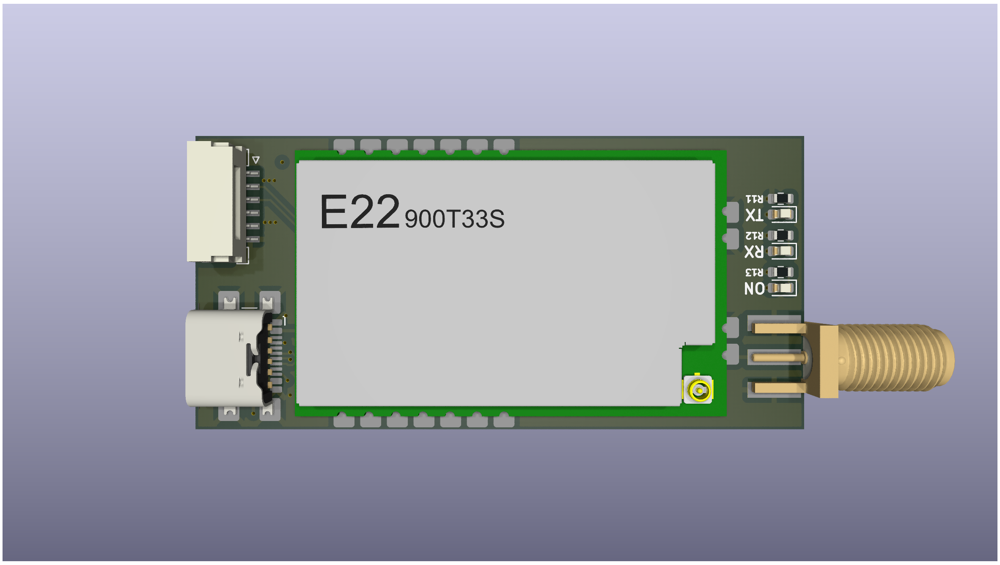

# LoRa TM

DIY telemetry module based Ebyte LoRa.

- 활동명 : [UAV] DIY Telemerty Module
- 일시 : 2024 동계방학
- 팀명 : 항공전자 (구 FC)
- 팀장 : 
  - 송민우 (2024) : 개념 설계, 회로 설계
  - 이현제 (2025) : 회로 설계, 펌웨어 작성

## USB CDC

ST에서 제공하는 라이브러리 사용시 RAM, Flash memory 용량 초과.

[Making USB Device With STM32 + TinyUSB](https://ejaaskel.dev/making-usb-device-with-stm32-tinyusb/)